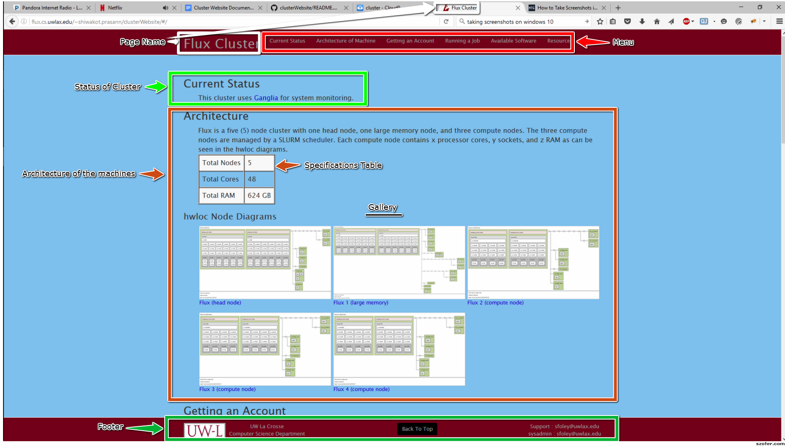
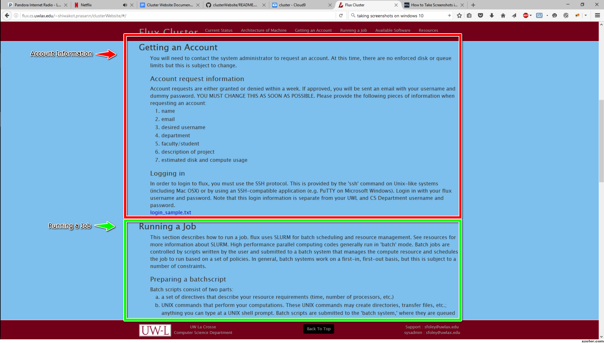
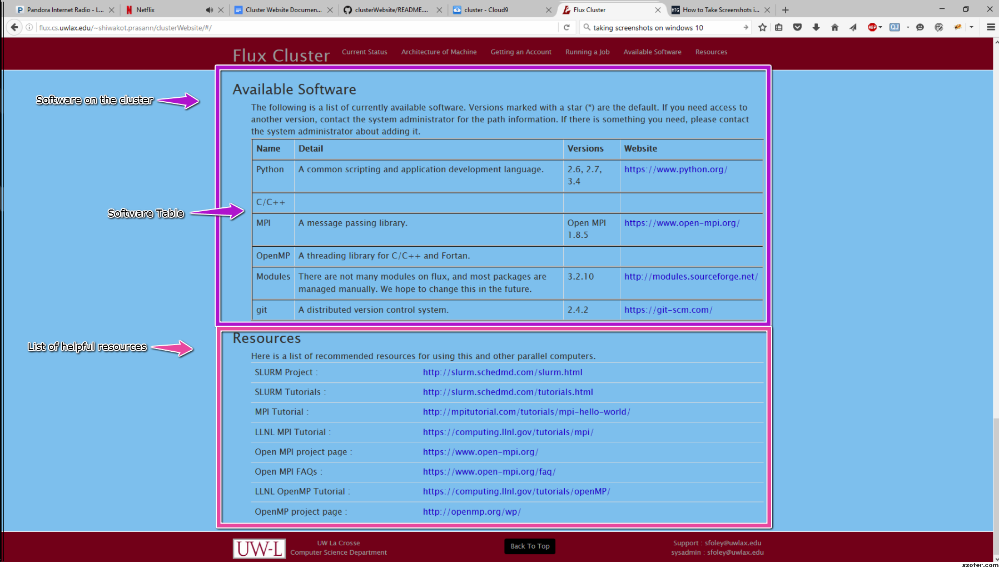

# cluster Website
This project is to develop a website that can be used to
share important information about an educational cluster.

## Introduction
This was originally desined for the flux cluster at UWL but can be used for any educational cluster.Here is a demo:http://flux.cs.uwlax.edu/~shiwakot.prasann/clusterWebsite

## Installation
If you would like to use the shell of the website it can be easily adapted to be used for your cluster.The project uses HTML, CSS Bootstrap, jQuery, Angularjs and Python. The html web page is styled with bootstrap and jQuery. The data is served as json files through a cherrypy server and fed through an  Angularjs app to the web site. The cluster app uses ngRoute as a dependency and utilizes the routing library to change views (ng-view) without refreshing.
 Clone the files above in the directory of your choice.Install [python] (https://www.python.org/downloads/) then download the [cherrypy] (http://docs.cherrypy.org/en/latest/install.html) package. Now you are ready to get started.

## Implementation

## Helpful Hints
### Changing appearances
Css is used to control the background and colors of the website. But if you know jquery it can be sometimes simpler to change css using it.Css file is at bootstrap/css/main.css.It is sorted first by tag,class,id then alphabetically.The jquery file is in js/simple.js.

### General practices
All the content editing will be done in the json files in the json folder.Each section has its own json file and will be edited from here.The general thing to remember while editing is if you have empty values for some of the keys, delete the value and leave it as an empty string.If you do not want an entire section it can be deleted but i recommend leaving the keys in if you think the section can be needed later.
