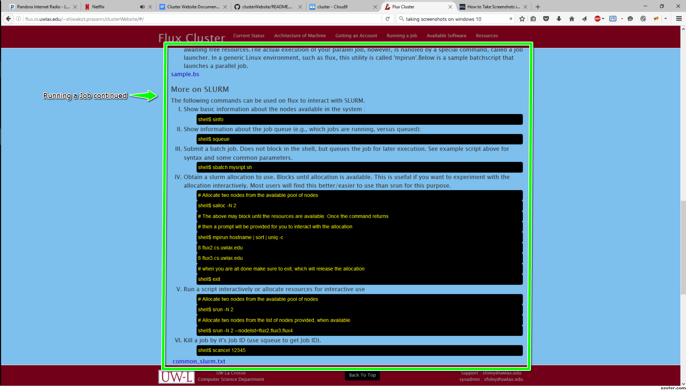

# Cluster Website
This project is to develop a website that can be used to
share important information about an educational cluster.

## Introduction
This was originally designed for the flux cluster at UWL but can be used for any educational cluster. Here is a demo:http://flux.cs.uwlax.edu/~shiwakot.prasann/clusterWebsite

## Installation
If you would like to use the skeleton of the website it can be easily adapted to be used for your cluster. The project uses HTML 5, CSS Bootstrap 3.3.7, jQuery 1.12.14, Angularjs 1.5.8 and Python 2.7.The html web page is styled with bootstrap and jQuery. The data is served as json files through a cherrypy server and fed through an  Angularjs app to the web site. The cluster app uses ngRoute as a dependency and utilizes the routing library to change views (ng-view) without refreshing. The website is linked to the Angularjs routing library 1.2.28.

### Software Setup
The project provides you with a cherrypy server(in the server folder) with minimal security. Therefore when running the server you will require a full featured web server installed on your machine to maintain security.
CSS bootstrap is statically linked and in  the bootstrap folder. If you wish to change the version, make sure to keep the bootstrap/css/main.css. You can change the Angularjs and jQuery version by changing the script they are linked to at the head of index.html.

### Getting it working
Clone the files above in the directory of your choice. Install [python] (https://www.python.org/downloads/) then download the [cherrypy] (http://docs.cherrypy.org/en/latest/install.html) package. Now you are ready to get started.
Go to the server folder using terminal and start the server.

    python clusterServer.py 

Now the menu json  file should show up at domainName/clusterWebsite/server/menuItems.json
You will need to go to js/services/serveMenu to change the string in  $http.get to 

    return $http.get('domainName/clusterWebsite/server/api/menuItems.json')

Now you should see the default menu appear.From here you need to change $http.get in the appropriate serveSectionName.js file to match the location your clusterServer.py mounts it to. The cluster website content is ready to be edited now.

## Implementation
All the content editing will be done in the json files in the json folder.Each section has its own json file and will be edited from here.

### Menu
The menu can be edited from json/menu_items.json. Here the first thing you will see is the title of the website.
The next item is the fav icon image, you can name your image file fav_icon.png and put it in img folder or simply insert the image path.The menu can be edited by changing name on menuItems.
   
###Footer

## Helpful Hints
### Changing appearances
Css is used to control the background and colors of the website. But if you know jquery it can be sometimes simpler to change css using it.Css file is at bootstrap/css/main.css.It is sorted first by tag,class,id then alphabetically.The jquery file is in js/simple.js.

#### CSS cheat sheet

### General practices
The general thing to remember while editing the json files is: if you have empty values for some of the keys, delete the value and leave it as an empty string.If you do not want an entire section it 
