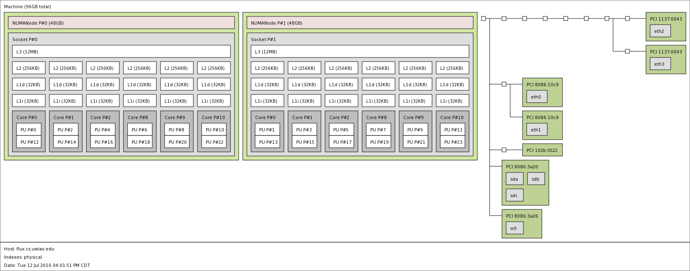
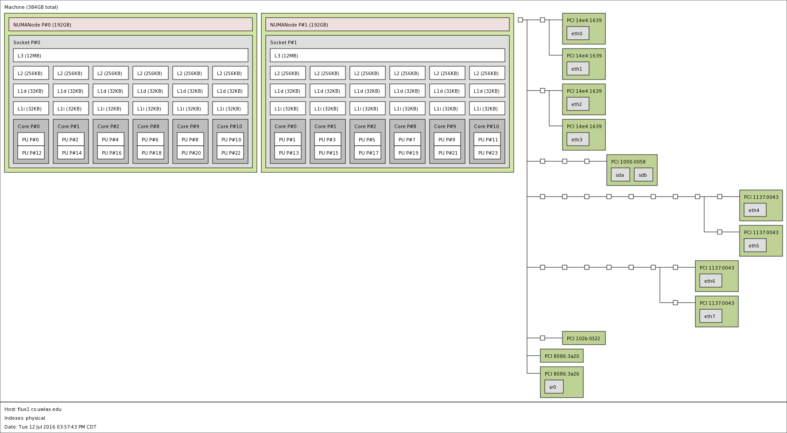
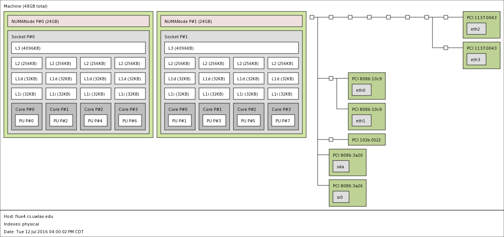

# Architecture

Flux is a five (5) node cluster with one head node, one large memory node, and three compute nodes.  The three compute nodes are managed by a SLURM scheduler.  Each compute node contains x processor cores, y sockets, and z RAM as can be seen in the hwloc diagrams.

### Node diagrams:
#### flux (head node)

#### flux1 (large memory machine)

#### flux2, flux3, flux4 (compute node)

